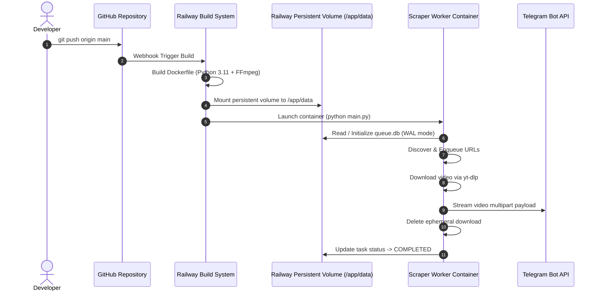

# 🚀 Deployment Guide: Bulk Video Scraper & Telegram Uploader

This document provides a comprehensive, step-by-step operational guide for deploying the **Bulk Video Scraper & Telegram Uploader** to **Railway**, **Docker containers (VPS / On-Premise)**, and integrating with **GitHub** for continuous automated deployment.

---

## 📑 Table of Contents

1. [Prerequisites](#1-prerequisites)
2. [Telegram Bot & Channel Setup](#2-telegram-bot--channel-setup)
3. [GitHub Repository Setup & Integration](#3-github-repository-setup--integration)
4. [Deploying to Railway (Recommended Cloud Deployment)](#4-deploying-to-railway)
   - [Step 4.1: Create Railway Project from GitHub](#step-41-create-railway-project-from-github)
   - [Step 4.2: Attach a Persistent Volume](#step-42-attach-a-persistent-volume)
   - [Step 4.3: Configure Environment Variables](#step-43-configure-environment-variables)
   - [Step 4.4: Deploy & Verify Logs](#step-44-deploy--verify-logs)
5. [Docker Container Setup (Local / VPS / Server)](#5-docker-container-setup)
   - [Option A: Docker CLI with Volume Mount](#option-a-docker-cli-with-volume-mount)
   - [Option B: Docker Compose (Production Ready)](#option-b-docker-compose-production-ready)
6. [Operational Maintenance & Day-2 Workflows](#6-operational-maintenance--day-2-workflows)
   - [Monitoring Queue Health](#monitoring-queue-health)
   - [Resetting Stalled Tasks](#resetting-stalled-tasks)
   - [Handling Large Media / Bot API Limits](#handling-large-media--bot-api-limits)

---

## 1. Prerequisites

Before starting deployment, ensure you have the following:

- [x] A **Telegram Account** with access to create bots via [@BotFather](https://t.me/BotFather).
- [x] A target **Telegram Channel or Supergroup** where media will be published.
- [x] A **GitHub Account** to host the codebase.
- [x] A **Railway Account** (free trial or hobby plan at [railway.app](https://railway.app)) OR a **Docker-enabled Linux VPS/server**.

---

## 2. Telegram Bot & Channel Setup

The scraper utilizes direct Bot Token HTTP API streaming without requiring user sessions or API ID / Hash credentials.

### Step 2.1: Create Bot via BotFather
1. Open Telegram and search for [@BotFather](https://t.me/BotFather).
2. Send `/newbot`.
3. Provide a display name (e.g., `Video Stream Bot`).
4. Provide a unique username ending in `bot` (e.g., `my_video_uploader_bot`).
5. Copy the generated **HTTP API Token** (Format: `1234567890:ABCdefGhIJKlmNoPQRsTUVwxyZ`).
   *This is your `TELEGRAM_BOT_TOKEN`.*

### Step 2.2: Add Bot as Channel Administrator
1. Navigate to your target Telegram Channel or Group.
2. Go to **Channel Settings** (or **Manage Channel**) ➔ **Administrators**.
3. Click **Add Administrator** and search for your bot username (`@my_video_uploader_bot`).
4. Enable **Post Messages** (and **Edit Messages** if desired) and confirm.

### Step 2.3: Find Your Target Chat ID
Telegram channel IDs have a `-100` prefix (e.g., `-1001987654321`).

**Method 1: Forward Message to Info Bot**
- Forward any message from your channel to [@RawDataBot](https://t.me/RawDataBot) or [@userinfobot](https://t.me/userinfobot).
- Look for `forward_from_chat.id` in the returned JSON.

**Method 2: Query Telegram API**
1. Post a test message in your channel.
2. In your web browser, navigate to:
   ```text
   https://api.telegram.org/bot<YOUR_BOT_TOKEN>/getUpdates
   ```
3. Locate the `"chat":{"id": -100xxxxxxxxxx}` field.
   *This is your `TELEGRAM_CHAT_ID`.*

---

## 3. GitHub Repository Setup & Integration

To enable automated Continuous Deployment (CD) with Railway, link the project to a GitHub repository.

### Step 3.1: Initialize Git Repository
In your local workspace:

```bash
cd web-tg

# Initialize git if not already initialized
git init

# Verify gitignore excludes local SQLite files, temp downloads, and secrets
cat .gitignore
```

Ensure `.gitignore` contains:
```gitignore
__pycache__/
*.py[cod]
.env
.venv/
venv/
data/
temp_downloads/
*.db
*.db-journal
*.db-wal
*.db-shm
```

### Step 3.2: Commit and Push to GitHub

```bash
# Add all files
git add .

# Create initial commit
git commit -m "feat: initial commit of bulk video scraper and telegram uploader"

# Set default branch
git branch -M main

# Add your GitHub remote (replace with your repository URL)
git remote add origin https://github.com/your-username/web-tg.git

# Push code to GitHub
git push -u origin main
```

---

## 4. Deploying to Railway

Railway provides effortless container builds, automated redeployments on `git push`, background worker hosting, and persistent volume support.



### Step 4.1: Create Railway Project from GitHub

1. Log into your [Railway Dashboard](https://railway.app/dashboard).
2. Click the **+ New Project** button in the top right.
3. Select **Deploy from GitHub repo**.
4. Grant Railway access to your GitHub account and choose your `web-tg` repository.
5. Railway will automatically analyze the repository, detect the `Dockerfile`, and prepare the service.

---

### Step 4.2: Attach a Persistent Volume

> [!IMPORTANT]
> The task queue database (`queue.db`) is stored in `/app/data`. Without a persistent volume, the database will reset whenever the container is redeployed or restarted, causing the crawler to re-scrape previously completed URLs.

1. In your Railway project view, click on the newly created service.
2. Select the **Volumes** tab from the top navigation.
3. Click **Add Volume** (or **+ New Volume**).
4. In the volume configuration modal:
   - **Mount Path**: Enter `/app/data`
   - Click **Add Volume** to confirm.

```text
Service Mount: /app/data ➔ Railway Persistent Storage
```

---

### Step 4.3: Configure Environment Variables

1. In your service settings, navigate to the **Variables** tab.
2. Click **+ New Variable** (or **RAW Editor**) and add the required environment variables:

| Variable Name | Example Value | Description |
| :--- | :--- | :--- |
| `TELEGRAM_BOT_TOKEN` | `123456789:ABCdefGHIjklMNOpqrSTUvwxYZ` | Your bot token from @BotFather |
| `TELEGRAM_CHAT_ID` | `-1001234567890` | Target Telegram channel/chat ID |
| `CRAWL_TARGET_URL` | `https://example.com/sitemap.xml` | Scraping entrypoint |
| `CRAWL_MODE` | `auto` | `auto`, `sitemap`, `pagination`, or `html5` |
| `MAX_PAGES` | `10` | Max pagination depth |
| `PERIODIC_CRAWL_INTERVAL` | `0` | `0` for run-once, or interval in seconds |
| `UPLOAD_COOLDOWN` | `20` | Pause in seconds between uploads |
| `DB_PATH` | `/app/data/queue.db` | Absolute path inside container |
| `TEMP_DOWNLOAD_DIR` | `/app/temp_downloads` | Ephemeral working directory |
| `PYTHONUNBUFFERED` | `1` | Real-time console logging |

---

### Step 4.4: Deploy & Verify Logs

1. Click **Deploy** in the top-right corner.
2. Navigate to the **Deployments** tab and click on the active deployment.
3. Select **View Logs** to monitor real-time output.

#### Expected Startup Logs:
```text
2026-09-01 08:30:00 [INFO] [App] === Initializing Video Scraper & Telegram Uploader Service ===
2026-09-01 08:30:00 [INFO] [modules.database] Database initialized at: /app/data/queue.db
2026-09-01 08:30:00 [INFO] [modules.downloader] Purged and reset temporary download directory: /app/temp_downloads
2026-09-01 08:30:01 [INFO] [modules.uploader] Telegram Bot verified successfully: @my_video_uploader_bot
2026-09-01 08:30:01 [INFO] [App] Telegram Bot connected: @my_video_uploader_bot
2026-09-01 08:30:01 [INFO] [App] --- STARTING PHASE 1: DISCOVERY ---
2026-09-01 08:30:05 [INFO] [App] Discovery Summary: 32 found, 32 enqueued, 0 duplicates skipped.
2026-09-01 08:30:05 [INFO] [App] --- STARTING PHASE 2: SEQUENTIAL WORKER PIPELINE ---
2026-09-01 08:30:05 [INFO] [App] Processing Task #1: Sample Video Title
...
2026-09-01 08:30:25 [INFO] [App] Task #1 uploaded to Telegram successfully!
2026-09-01 08:30:25 [INFO] [App] Disk cleaned up for Task #1. Ephemeral storage clear.
```

---

## 5. Docker Container Setup

For deploying on self-hosted servers, VPS instances (DigitalOcean, Hetzner, AWS, Linode), or local hardware.

### Option A: Docker CLI with Volume Mount

1. **Build the container image**:
   ```bash
   docker build -t web-tg-scraper:latest .
   ```

2. **Create local data directory for persistence**:
   ```bash
   mkdir -p $(pwd)/data
   ```

3. **Run the container**:
   ```bash
   docker run -d \
     --name web-tg-worker \
     --restart unless-stopped \
     --env-file .env \
     -v $(pwd)/data:/app/data \
     web-tg-scraper:latest
   ```

4. **Monitor logs**:
   ```bash
   docker logs -f web-tg-worker
   ```

5. **Stop / Restart container**:
   ```bash
   docker stop web-tg-worker
   docker start web-tg-worker
   ```

---

### Option B: Docker Compose (Production Ready)

Create a `docker-compose.yml` file in your project directory:

```yaml
version: "3.8"

services:
  video-uploader:
    build:
      context: .
      dockerfile: Dockerfile
    container_name: web-tg-worker
    restart: unless-stopped
    env_file:
      - .env
    volumes:
      # Persistent SQLite task queue
      - ./data:/app/data
    environment:
      - PYTHONUNBUFFERED=1
      - DB_PATH=/app/data/queue.db
      - TEMP_DOWNLOAD_DIR=/app/temp_downloads
    logging:
      driver: "json-file"
      options:
        max-size: "20m"
        max-file: "5"
```

#### Starting with Docker Compose:
```bash
# Start in background
docker compose up -d --build

# View real-time logs
docker compose logs -f

# Check container status
docker compose ps

# Graceful shutdown
docker compose down
```

---

## 6. Operational Maintenance & Day-2 Workflows

### Monitoring Queue Health

You can inspect the current queue metrics at any time by executing the CLI `--stats` command against the running container or local environment:

#### On Local / Server:
```bash
python main.py --stats
```

#### Inside Docker / Railway Container:
```bash
# Docker
docker exec -it web-tg-worker python main.py --stats

# Output:
--- Current Queue Statistics ---
  PENDING        : 18
  DOWNLOADING    : 0
  UPLOADING      : 1
  COMPLETED      : 94
  FAILED         : 1
  TOTAL          : 114
--------------------------------
```

---

### Resetting Stalled Tasks

If a host server crashes during an active upload, tasks in `DOWNLOADING` or `UPLOADING` status are automatically reset to `PENDING` upon startup.

To trigger a manual reset without restarting the service:
```bash
python main.py --reset-queue
```

---

### Handling Large Media & Telegram Bot API Limits

1. **Standard Telegram Bot Limit**: Direct Telegram Bot API allows bots to upload media up to **50 MB**.
2. **Self-Hosted Local Telegram Bot API**:
   - If you need to upload videos up to **2000 MB (2 GB)**, deploy the official [Telegram Bot API Server](https://core.telegram.org/bots/api#using-a-local-bot-api-server).
   - Once running, simply configure `TELEGRAM_API_BASE=http://<your-local-api-ip>:8081` in your `.env` or Railway environment variables.
3. **Upload Rate Limiting**:
   - Keep `UPLOAD_COOLDOWN=20` (or higher) to maintain compliance with Telegram's global broadcast rate limits (max ~30 messages per second across chats, ~20 per minute in a single channel).

---

## 📋 Quick Reference: Common Commands

| Purpose | Command |
| :--- | :--- |
| **Start Full Service** | `python main.py` |
| **Discovery Scan Only** | `python main.py --crawl-only` |
| **Worker Process Only** | `python main.py --worker-only` |
| **View Queue Statistics** | `python main.py --stats` |
| **Reset Interrupted Tasks** | `python main.py --reset-queue` |
| **Docker Build** | `docker build -t web-tg-scraper .` |
| **Docker Compose Up** | `docker compose up -d --build` |
| **Docker Logs** | `docker logs -f web-tg-worker` |

---

*Need help or encountered an issue? Open an issue on GitHub or check the troubleshooting section in [README.md](README.md).*
