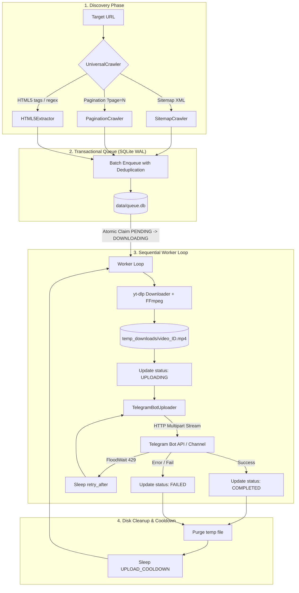

# 🚀 Bulk Video Scraper & Telegram Uploader

[](https://www.python.org/downloads/)
[](https://www.docker.com/)
[](https://railway.app)
[](LICENSE)

An enterprise-grade, lightweight, and resilient automated pipeline designed to discover, download, and stream media files directly into Telegram channels and chats using the direct Telegram Bot HTTP API.

Engineered with a **strict zero-disk-leak sequential pipeline**, SQLite WAL-mode transactional queue, automatic deduplication, intelligent flood-wait throttling, and multi-strategy web crawlers.

---

## 📑 Table of Contents

- [Key Features](#-key-features)
- [Architecture Overview](#-architecture-overview)
- [Project Structure](#-project-structure)
- [Quickstart (Local Development)](#-quickstart-local-development)
  - [Prerequisites](#prerequisites)
  - [Installation](#installation)
  - [Configuration](#configuration)
  - [Execution](#execution)
- [Railway Deployment (1-Click & Git)](#-railway-deployment)
- [Docker Container Setup](#-docker-container-setup)
- [Environment Variables Reference](#-environment-variables-reference)
- [CLI Commands Reference](#-cli-commands-reference)
- [Telegram Bot & Chat ID Setup](#-telegram-bot--chat-id-setup)
- [Operational Safety & Resilience](#-operational-safety--resilience)
- [Troubleshooting & FAQ](#-troubleshooting--faq)

---

## ✨ Key Features

- **🌐 Multi-Strategy Universal Crawler**:
  - **Sitemap Crawler**: Recursively parses standard XML sitemaps and sitemap index files.
  - **Pagination Crawler**: Traverses paginated listing pages (`?page=1..N`).
  - **HTML5 Extractor**: Detects and extracts `<video>`, `<source>`, and inline JavaScript video streams (`.mp4`, `.m3u8`, `.webm`, etc.).
  - **Auto-Detection Mode**: Dynamically selects the optimal crawling strategy based on the target URL.

- **🛡️ Resilient Transactional Queue (SQLite + WAL)**:
  - Built with Write-Ahead Logging (WAL) for high concurrency and crash resilience.
  - Atomic state transitions (`PENDING` ➔ `DOWNLOADING` ➔ `UPLOADING` ➔ `COMPLETED` / `FAILED`).
  - Automatic URL deduplication via unique constraints.
  - Automatic startup crash recovery (stalled tasks in `DOWNLOADING` or `UPLOADING` are reset to `PENDING`).

- **💾 Zero-Disk-Footprint Sequential Pipeline**:
  - Processes media strictly sequentially: **Download 1 ➔ Upload 1 ➔ Delete 1 ➔ Cooldown ➔ Repeat**.
  - Ephemeral temporary storage is completely wiped on startup and guaranteed cleaned via `finally` blocks.
  - Suitable for resource-constrained environments (e.g., free/starter cloud tiers with minimal disk space).

- **🤖 Direct Telegram Bot API Integration**:
  - Uses direct Bot Token HTTP multipart streaming (`sendVideo` / `sendDocument`).
  - **Zero user session credentials required**: No `api_id` or `api_hash` needed.
  - Native rate limit handling: Intercepts `HTTP 429 FloodWait` and honors `retry_after` parameters.
  - Automatic fallback from `sendVideo` to `sendDocument` if container metadata is incompatible.
  - Attaches extracted metadata: Video titles, duration, dimensions, thumbnails, and `supports_streaming` flag.

- **⏱️ Scheduled Continuous Monitoring**:
  - Configurable periodic crawl intervals (`PERIODIC_CRAWL_INTERVAL`) for continuous target monitoring.
  - Configurable upload cooldown (`UPLOAD_COOLDOWN`) to protect against Telegram spam flags.

---

## 🏗 Architecture Overview



---

## 📂 Project Structure

```text
web-tg/
├── .env.example              # Template for environment variables
├── .gitignore                # Git ignore patterns (ignores DB, temp files, secrets)
├── Dockerfile                # Multi-stage production container with FFmpeg
├── Procfile                  # Worker process definition for Railway / Heroku
├── requirements.txt          # Python dependencies
├── main.py                   # CLI entry point and async pipeline orchestrator
├── data/                     # Persistent SQLite storage directory (mounted via volume)
│   └── queue.db              # SQLite queue database (auto-created)
├── temp_downloads/           # Ephemeral storage for active downloads (cleaned automatically)
└── modules/
    ├── __init__.py
    ├── crawler.py            # UniversalCrawler, SitemapCrawler, PaginationCrawler, HTML5Extractor
    ├── database.py           # SQLite DatabaseManager with WAL mode & atomic state transitions
    ├── downloader.py         # yt-dlp VideoDownloader with FFmpeg integration and metadata extractor
    └── uploader.py           # TelegramBotUploader with multipart streaming & FloodWait backoff
```

---

## ⚡ Quickstart (Local Development)

### Prerequisites

1. **Python 3.10+** installed on your system.
2. **FFmpeg** installed and accessible in your system `PATH`:
   - **Linux (Ubuntu/Debian)**: `sudo apt-get update && sudo apt-get install -y ffmpeg`
   - **macOS (Homebrew)**: `brew install ffmpeg`
   - **Windows (Chocolatey/Scoop)**: `choco install ffmpeg` or `scoop install ffmpeg`
3. A **Telegram Bot Token** (created via [@BotFather](https://t.me/BotFather)) and a **Target Chat ID**.

### Installation

1. **Clone the repository**:
   ```bash
   git clone https://github.com/your-username/web-tg.git
   cd web-tg
   ```

2. **Create and activate a virtual environment**:
   ```bash
   # Linux / macOS
   python3 -m venv venv
   source venv/bin/activate

   # Windows (PowerShell)
   python -m venv venv
   .\venv\Scripts\Activate.ps1
   ```

3. **Install dependencies**:
   ```bash
   pip install -r requirements.txt
   ```

### Configuration

Copy the sample environment file and configure your credentials:

```bash
cp .env.example .env
```

Edit `.env` with your settings:

```dotenv
# Telegram Bot Configuration
TELEGRAM_BOT_TOKEN=123456789:ABCdefGHIjklMNOpqrSTUvwxYZ
TELEGRAM_CHAT_ID=-1001234567890

# Target Scraping Configuration
CRAWL_TARGET_URL=https://example.com/sitemap.xml
CRAWL_MODE=auto
MAX_PAGES=10
PERIODIC_CRAWL_INTERVAL=0

# Rate Limiting & Storage
UPLOAD_COOLDOWN=20
DB_PATH=data/queue.db
TEMP_DOWNLOAD_DIR=temp_downloads
```

### Execution

Run the complete pipeline (Discovery ➔ Continuous Worker):

```bash
python main.py
```

---

## 🚂 Railway Deployment

Deploying on [Railway](https://railway.app) allows 24/7 background execution with persistent storage.

### Method 1: Deploy from GitHub (Recommended)

1. Push this repository to your GitHub account.
2. Log in to [Railway Dashboard](https://railway.app/dashboard).
3. Click **New Project** ➔ **Deploy from GitHub repo** ➔ Select your repository.
4. Railway will automatically detect the `Dockerfile` and `Procfile`.

### Method 2: Configure Persistent Storage & Environment Variables

> [!IMPORTANT]
> To prevent queue re-scraping and losing task progress across deployments, attach a Persistent Volume to `/app/data`.

1. In your Railway Project Canvas, click on your service.
2. Navigate to **Volumes** ➔ Click **Add Volume**.
3. Set the **Mount Path** to:
   ```text
   /app/data
   ```
4. Navigate to **Variables** and configure:
   - `TELEGRAM_BOT_TOKEN`: `Your bot token from @BotFather`
   - `TELEGRAM_CHAT_ID`: `Your target channel ID (e.g., -100xxxxxxxxxx)`
   - `CRAWL_TARGET_URL`: `https://example.com/sitemap.xml`
   - `CRAWL_MODE`: `auto`
   - `MAX_PAGES`: `10`
   - `UPLOAD_COOLDOWN`: `20`
   - `PERIODIC_CRAWL_INTERVAL`: `0` (or `3600` for hourly crawl)
5. Click **Deploy**. Railway will build the container with FFmpeg and start the worker process.

For a comprehensive step-by-step walkthrough, see [DEPLOYMENT.md](DEPLOYMENT.md).

---

## 🐳 Docker Container Setup

You can run the service locally or on any VPS using Docker:

### Build Docker Image

```bash
docker build -t web-tg-scraper .
```

### Run with Persistent Volume

```bash
# Linux / macOS
docker run -d \
  --name web-tg-worker \
  --restart unless-stopped \
  --env-file .env \
  -v $(pwd)/data:/app/data \
  web-tg-scraper

# Windows PowerShell
docker run -d `
  --name web-tg-worker `
  --restart unless-stopped `
  --env-file .env `
  -v ${PWD}/data:/app/data `
  web-tg-scraper
```

### View Live Logs

```bash
docker logs -f web-tg-worker
```

---

## ⚙️ Environment Variables Reference

| Variable | Type | Default | Description |
| :--- | :--- | :--- | :--- |
| `TELEGRAM_BOT_TOKEN` | `string` | *Required* | API token generated by [@BotFather](https://t.me/BotFather). |
| `TELEGRAM_CHAT_ID` | `string` | *Required* | Telegram target chat, channel, or group ID (e.g., `-1001234567890`). |
| `CRAWL_TARGET_URL` | `string` | `""` | Target URL to discover media links from (XML sitemap, index page, or video page). |
| `CRAWL_MODE` | `string` | `auto` | Crawler strategy: `auto`, `sitemap`, `pagination`, or `html5`. |
| `MAX_PAGES` | `integer` | `10` | Maximum number of pages to scan when using `pagination` crawler mode. |
| `PERIODIC_CRAWL_INTERVAL` | `integer` | `0` | Seconds between recurring discovery scans (`0` = disable recurring scan, run once at startup). |
| `UPLOAD_COOLDOWN` | `integer` | `20` | Cooldown pause in seconds between consecutive Telegram uploads. |
| `DB_PATH` | `string` | `data/queue.db` | File path for the SQLite task queue database. |
| `TEMP_DOWNLOAD_DIR` | `string` | `temp_downloads` | Temporary folder for active video downloads (purged automatically). |
| `TELEGRAM_API_BASE` | `string` | `https://api.telegram.org` | Base URL for Telegram Bot API (or custom local Bot API server). |
| `PYTHONUNBUFFERED` | `integer` | `1` | Forces unbuffered stdout for instantaneous log streaming. |

---

## 💻 CLI Commands Reference

The orchestrator `main.py` provides flexible execution modes via command-line arguments:

```bash
# Standard Execution: Run Discovery crawl then continuous Worker processing
python main.py

# Discovery Only: Crawl target URL, enqueue unique media to DB, and exit
python main.py --crawl-only

# Worker Only: Process existing queue items without triggering discovery crawl
python main.py --worker-only

# Queue Statistics: Display a snapshot of queue task counts by status and exit
python main.py --stats

# Queue Reset: Reset any tasks stuck in DOWNLOADING / UPLOADING back to PENDING and exit
python main.py --reset-queue

# Help / Usage Information
python main.py --help
```

### Example Statistics Output

```text
--- Current Queue Statistics ---
  PENDING        : 45
  DOWNLOADING    : 0
  UPLOADING      : 0
  COMPLETED      : 128
  FAILED         : 2
  TOTAL          : 175
--------------------------------
```

---

## 🔑 Telegram Bot & Chat ID Setup

### 1. Create a Bot
1. Open Telegram and search for [@BotFather](https://t.me/BotFather).
2. Send `/newbot` and follow the prompts to choose a bot name and username.
3. Copy the generated **HTTP API Token** (e.g., `7123456789:AAHfkjds...`).

### 2. Set Up Target Channel or Group
1. Create a new Telegram Channel or Group.
2. Open Channel/Group Settings ➔ **Administrators** ➔ **Add Administrator**.
3. Search for your bot username and grant **Post Messages** permissions.

### 3. Retrieve Channel Chat ID
- **Method A (Easiest)**: Forward any message from your channel to [@RawDataBot](https://t.me/RawDataBot) or [@userinfobot](https://t.me/userinfobot) to view the channel's `forward_from_chat.id` (starts with `-100`).
- **Method B (API)**:
  1. Post a test message in your channel.
  2. Visit: `https://api.telegram.org/bot<YOUR_BOT_TOKEN>/getUpdates`
  3. Look for `"chat":{"id": -100xxxxxxxxxx}` in the JSON response.

---

## 🔒 Operational Safety & Resilience

- **Atomic Queue Leases**: Items are atomically transitioned from `PENDING` to `DOWNLOADING` using SQLite transactions, preventing multiple workers from downloading the same video twice.
- **Fail-Safe Cleanup**: File removal is encapsulated in Python `try...finally` blocks. Even if a download fails, a network drops, or Telegram returns an error, temp files are deleted immediately.
- **FloodWait Protection**: Telegram's HTTP 429 response is parsed for `retry_after`. The worker automatically pauses for the required duration plus a 3-second safety margin before retrying.
- **Automatic Fallback**: If `sendVideo` fails due to unsupported codecs or streaming flags, the uploader falls back to `sendDocument` so uploads are never lost.
- **Process Signals**: Handles `SIGINT` (Ctrl+C) and `SIGTERM` gracefully, allowing current disk cleanup routines to finish before shutting down.

---

## ❓ Troubleshooting & FAQ

<details>
<summary><strong>Q: Why is my upload failing with "Chat not found" or "Forbidden"?</strong></summary>

Ensure your bot has been added to the target channel as an **Administrator** with permission to **Post Messages**. Also check that `TELEGRAM_CHAT_ID` includes the leading `-100` prefix for supergroups and channels (e.g., `-1001234567890`).
</details>

<details>
<summary><strong>Q: What is the maximum video file size supported?</strong></summary>

The standard Telegram Bot API allows bots to upload files up to **50 MB** via the public `api.telegram.org` endpoint. If you self-host a [Telegram Bot API Server](https://core.telegram.org/bots/api#using-a-local-bot-api-server), uploads up to **2000 MB (2 GB)** are supported. Set `TELEGRAM_API_BASE=http://your-local-api-server:8081` in your `.env`.
</details>

<details>
<summary><strong>Q: Will my queue be lost if Railway rebuilds or restarts the container?</strong></summary>

Not if you have configured a **Persistent Volume** mounted at `/app/data`. The SQLite database will persist indefinitely on the volume across code updates, redeploys, and crashes.
</details>

<details>
<summary><strong>Q: How do I re-try failed tasks?</strong></summary>

You can reset failed tasks by running:
```bash
python main.py --reset-queue
```
Or interact directly with the SQLite database:
```sql
UPDATE queue SET status = 'PENDING', error_message = NULL WHERE status = 'FAILED';
```
</details>

---

## 📄 License

This project is licensed under the [MIT License](LICENSE).
